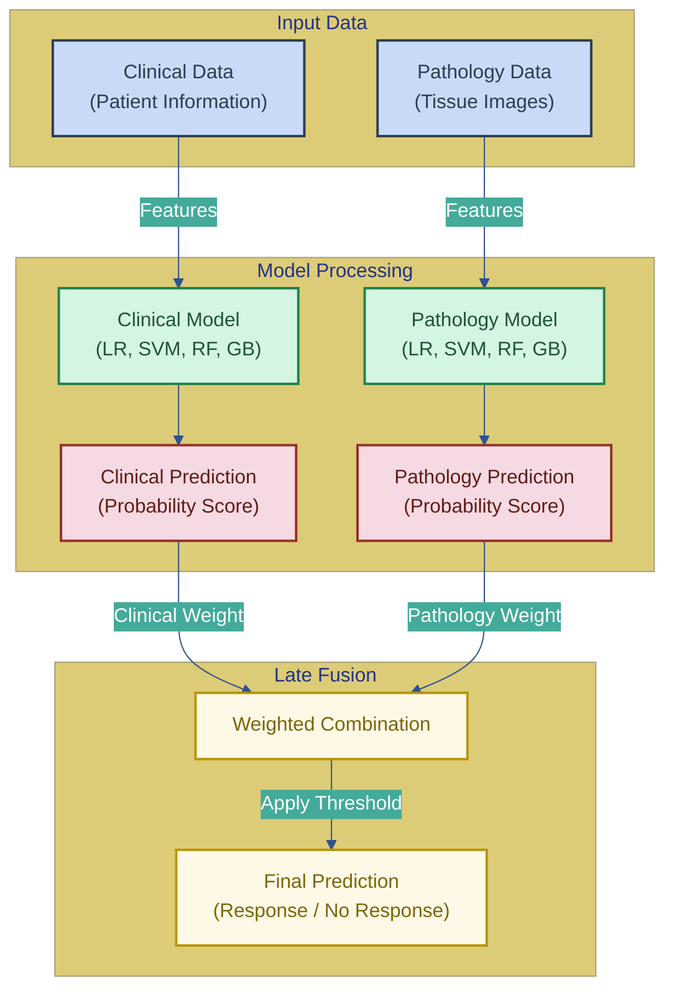
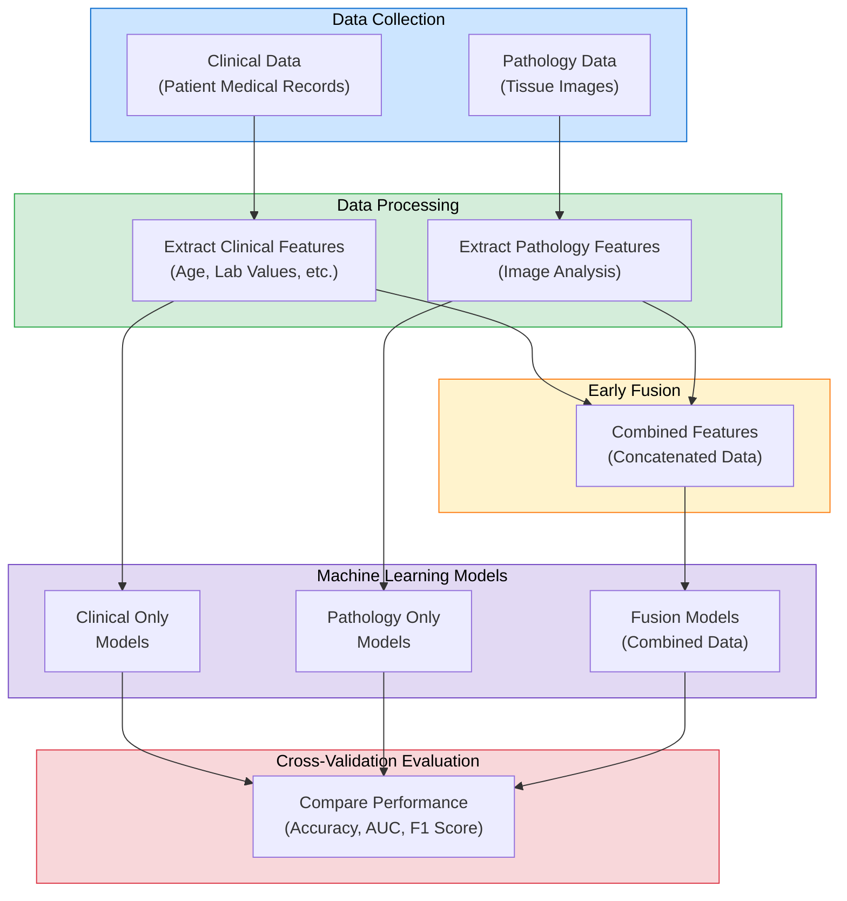

# Multimodal Late Fusion

```mermaid
%%{init: {'theme': 'base', 'themeVariables': { 'fontSize': '16px', 'primaryColor': '#3A6EA5', 'primaryTextColor': '#FFFFFF', 'primaryBorderColor': '#1F456E', 'lineColor': '#2F528F', 'secondaryColor': '#44AA99', 'tertiaryColor': '#DDCC77' }}}%%
flowchart TD
    subgraph Input ["Input Data"]
        C["Clinical Data<br>(Patient Information)"] 
        P["Pathology Data<br>(Tissue Images)"]
    end
    
    subgraph Processing ["Model Processing"]
        C --> |Features| CM["Clinical Model<br>(LR, SVM, RF, GB)"]
        P --> |Features| PM["Pathology Model<br>(LR, SVM, RF, GB)"]
        
        CM --> CP["Clinical Prediction<br>(Probability Score)"]
        PM --> PP["Pathology Prediction<br>(Probability Score)"]
    end
    
    subgraph Fusion ["Late Fusion"]
        CP --> |Clinical Weight| F["Weighted Combination"]
        PP --> |Pathology Weight| F
        F --> |Apply Threshold| FP["Final Prediction<br>(Response / No Response)"]
    end
    
    classDef inputBox fill:#C9DAF8,stroke:#2C3E50,stroke-width:2px,color:#2C3E50
    classDef modelBox fill:#D5F5E3,stroke:#1E8449,stroke-width:2px,color:#1E5631
    classDef fusionBox fill:#FEF9E7,stroke:#B7950B,stroke-width:2px,color:#7D6608
    classDef predictionBox fill:#F5DAE3,stroke:#943126,stroke-width:2px,color:#621B16
    
    class C,P inputBox
    class CM,PM modelBox
    class CP,PP predictionBox
    class F,FP fusionBox

```

# Multimodal Late Fusion

```mermaid
flowchart TD
    subgraph Input["Data Collection"]
        A["Clinical Data\n(Patient Medical Records)"] 
        B["Pathology Data\n(Tissue Images)"]
    end

    subgraph Processing["Data Processing"]
        C["Extract Clinical Features\n(Age, Lab Values, etc.)"]
        D["Extract Pathology Features\n(Image Analysis)"]
    end

    subgraph Fusion["Early Fusion"]
        E["Combined Features\n(Concatenated Data)"]
    end

    subgraph Models["Machine Learning Models"]
        F["Clinical Only\nModels"]
        G["Pathology Only\nModels"]
        H["Fusion Models\n(Combined Data)"]
    end

    subgraph Evaluation["Cross-Validation Evaluation"]
        I["Compare Performance\n(Accuracy, AUC, F1 Score)"]
    end

    A --> C
    B --> D
    C --> F
    D --> G
    C --> E
    D --> E
    E --> H
    F --> I
    G --> I
    H --> I
    
    classDef blue fill:#cce5ff,stroke:#0066cc,color:#000
    classDef green fill:#d4edda,stroke:#28a745,color:#000
    classDef orange fill:#fff3cd,stroke:#fd7e14,color:#000
    classDef purple fill:#e2d9f3,stroke:#6f42c1,color:#000
    classDef red fill:#f8d7da,stroke:#dc3545,color:#000
    
    class Input blue
    class Processing green
    class Fusion orange
    class Models purple
    class Evaluation red
```
