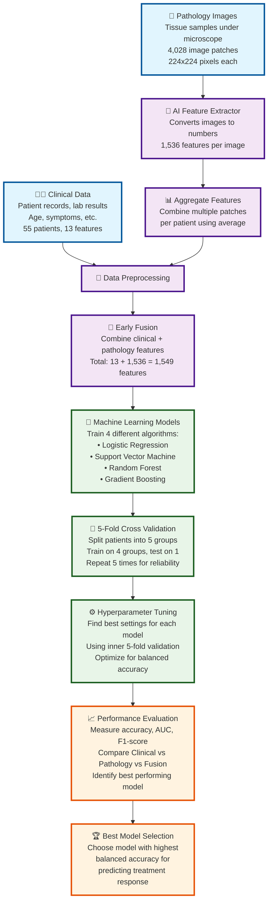

# Multimodal Early Fusion

```mermaid
graph TD
    %% Data Sources
    A[👨‍⚕️ Clinical Data<br/>Patient records, lab results<br/>Age, symptoms, etc.<br/>55 patients, 13 features] --> E[🔄 Data Preprocessing]
    B[🔬 Pathology Images<br/>Tissue samples under microscope<br/>4,028 image patches<br/>224x224 pixels each] --> C[🤖 AI Feature Extractor<br/>Converts images to numbers<br/>1,536 features per image]
    
    C --> D[📊 Aggregate Features<br/>Combine multiple patches<br/>per patient using average]
    D --> E
    
    %% Early Fusion
    E --> F[🔗 Early Fusion<br/>Combine clinical + pathology features<br/>Total: 13 + 1,536 = 1,549 features]
    
    %% Model Training
    F --> G[🎯 Machine Learning Models<br/>Train 4 different algorithms:<br/>• Logistic Regression<br/>• Support Vector Machine<br/>• Random Forest<br/>• Gradient Boosting]
    
    %% Cross Validation
    G --> H[🔄 5-Fold Cross Validation<br/>Split patients into 5 groups<br/>Train on 4 groups, test on 1<br/>Repeat 5 times for reliability]
    
    %% Hyperparameter Tuning
    H --> I[⚙️ Hyperparameter Tuning<br/>Find best settings for each model<br/>Using inner 5-fold validation<br/>Optimize for balanced accuracy]
    
    %% Results
    I --> J[📈 Performance Evaluation<br/>Measure accuracy, AUC, F1-score<br/>Compare Clinical vs Pathology vs Fusion<br/>Identify best performing model]
    
    %% Final Output
    J --> K[🏆 Best Model Selection<br/>Choose model with highest<br/>balanced accuracy for<br/>predicting treatment response]
    
    %% Styling
    classDef dataSource fill:#e1f5fe,stroke:#01579b,stroke-width:3px
    classDef processing fill:#f3e5f5,stroke:#4a148c,stroke-width:3px
    classDef model fill:#e8f5e8,stroke:#1b5e20,stroke-width:3px
    classDef result fill:#fff3e0,stroke:#e65100,stroke-width:3px
    
    class A,B dataSource
    class C,D,E,F processing
    class G,H,I model
    class J,K result
```
