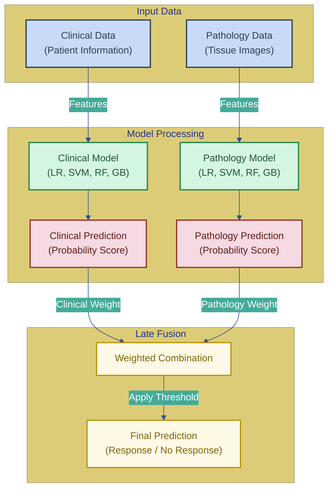

# Multimodal Late Fusion

```mermaid
%%{init: {'theme': 'base', 'themeVariables': { 'fontSize': '16px', 'primaryColor': '#3A6EA5', 'primaryTextColor': '#FFFFFF', 'primaryBorderColor': '#1F456E', 'lineColor': '#2F528F', 'secondaryColor': '#44AA99', 'tertiaryColor': '#DDCC77' }}}%%
flowchart TD
    subgraph Input ["Input Data"]
        C["Clinical Data<br>(Patient Information)"] 
        P["Pathology Data<br>(Tissue Images)"]
    end
    
    subgraph Processing ["Model Processing"]
        C --> |Features| CM["Clinical Model<br>(LR, SVM, RF, GB)"]
        P --> |Features| PM["Pathology Model<br>(LR, SVM, RF, GB)"]
        
        CM --> CP["Clinical Prediction<br>(Probability Score)"]
        PM --> PP["Pathology Prediction<br>(Probability Score)"]
    end
    
    subgraph Fusion ["Late Fusion"]
        CP --> |Clinical Weight| F["Weighted Combination"]
        PP --> |Pathology Weight| F
        F --> |Apply Threshold| FP["Final Prediction<br>(Response / No Response)"]
    end
    
    classDef inputBox fill:#C9DAF8,stroke:#2C3E50,stroke-width:2px,color:#2C3E50
    classDef modelBox fill:#D5F5E3,stroke:#1E8449,stroke-width:2px,color:#1E5631
    classDef fusionBox fill:#FEF9E7,stroke:#B7950B,stroke-width:2px,color:#7D6608
    classDef predictionBox fill:#F5DAE3,stroke:#943126,stroke-width:2px,color:#621B16
    
    class C,P inputBox
    class CM,PM modelBox
    class CP,PP predictionBox
    class F,FP fusionBox

```
